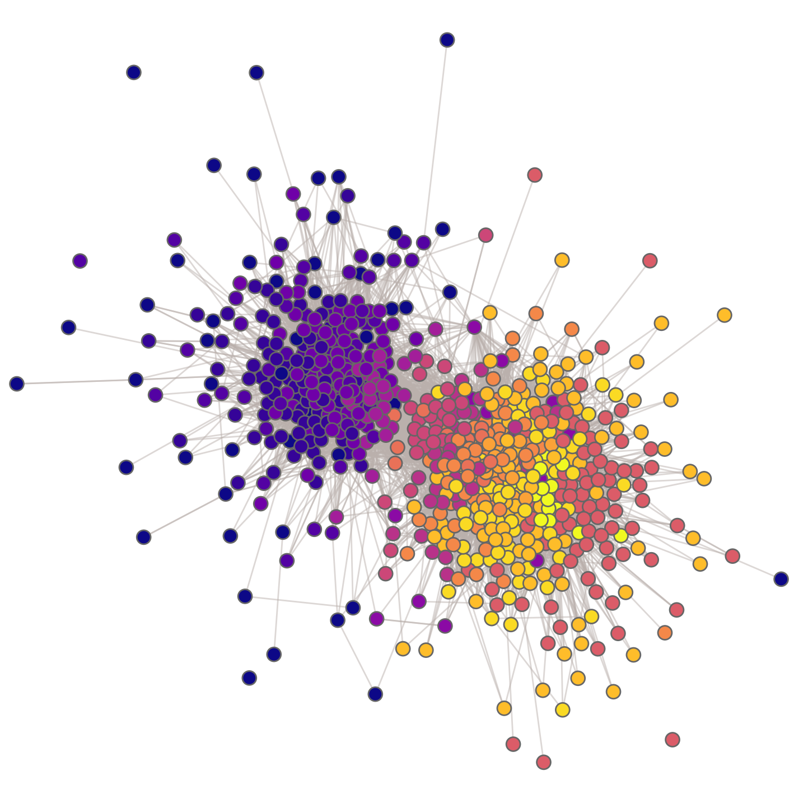

# Drawing a graph/network with matplotlib

About
-----
* Function for drawing a graph with matplotlib.
  * Using matplotlib's LineCollection to draw edges relatively fast.
  * Various visual encodings for graph vertices (e.g., colored by numerical and categorical values)
  * Other custom settings, including vertex filtering, saving files, etc.

Requirements
-----
* Python 3
* Numpy and matplotlib

Usage
-----
* See the documentation of 'plot_nw' in 'graph_draw.py'
* Also, you can find examples using graph-tool and NetworkX in 'graph_draw.py'.

  `python3 graph_dray.py`

  * graph-tool: https://graph-tool.skewed.de/

    * With HomeBrew, you can install with `brew install graph-tool`

  * NetworkX: https://networkx.org/

    * With pip, you can install with `pip3 install networkx`
